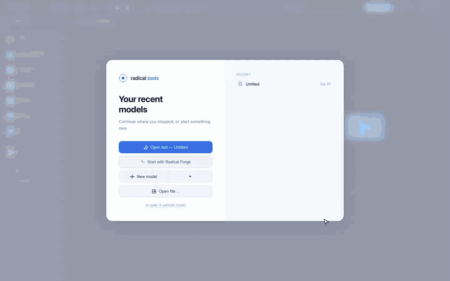
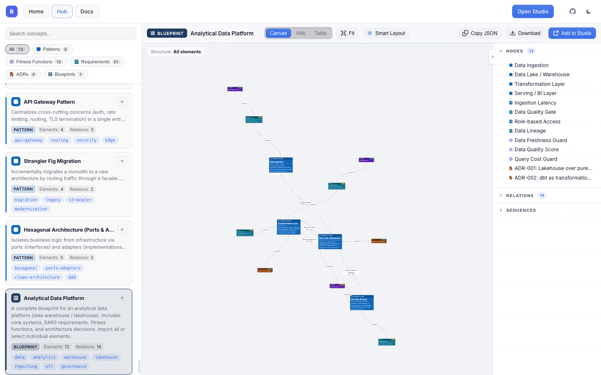
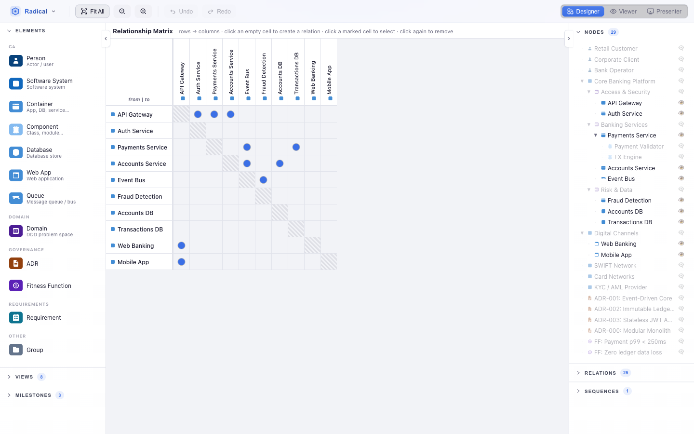

<div align="center">

# radical.tools

**Open-source architecture studio: C4 models, ADRs, fitness functions and requirements in one living model, with an AI co-architect.**

[](https://github.com/radicaltools/radical.tools/actions/workflows/ci.yml)
[](LICENSE)
[](https://studio.radical.tools)

[**Try it in the browser**](https://studio.radical.tools) · [Architecture Hub](https://hub.radical.tools) · [Manual](https://radical.tools/manual.html)



</div>

## Why radical.tools?

Architecture diagrams go stale because they are pictures. In radical.tools they are **views of one model**. Every element lives once, and the canvas, dependency matrix, sequence diagram, table and wiki all read from it. The decisions, requirements and fitness functions that explain the architecture live in the same model, linked to the elements they govern.

- **No account, nothing to install.** Open it in the browser and start modelling. Your model stays in local storage or plain files you can commit.
- **C4 without the busywork.** Smart Layout places nodes, minimises crossings and fits groups for you.
- **From a paragraph to a model.** Radical Forge turns a system description into requirements, fitness functions, Gherkin scenarios, UI mockups and a C4 model, one reviewable stage at a time.
- **Bring your own AI.** OpenAI, Anthropic, Gemini, or a local model through Ollama.
- **Don't start from zero.** Import from 120+ curated patterns, ADRs, fitness functions and blueprints in the [Architecture Hub](https://hub.radical.tools).

<table>
  <tr>
    <td width="50%"><br><sub><b>UI mockups & screen flows</b>, AI-generated wireframes linked to requirements</sub></td>
    <td width="50%"><br><sub><b>Architecture Hub</b>, curated concepts you can import in one click</sub></td>
  </tr>
  <tr>
    <td width="50%"><br><sub><b>Dependency matrix</b>, one of six views over the same model</sub></td>
    <td width="50%"><br><sub><b>Architecture wiki</b>, documentation generated from the model</sub></td>
  </tr>
</table>

## Try it

Open [**studio.radical.tools**](https://studio.radical.tools). No sign-up, nothing to install.

**Desktop app:** there are no prebuilt installers yet. To run it as an Electron app, build it from source (see [Getting started](#getting-started)): `npm install && npm run dist` produces an installer for your OS in `dist/`.

**VS Code:** an extension that opens `.radical` files right in the editor lives in [tools/vscode-radical](tools/vscode-radical).

## Features

- **C4 model**: Person, Software System, Container, Component, Database, Web App, Queue, Relation
- **Domain & Governance elements**: Domain, ADR, Fitness Function, Requirement, Blueprint
- **UI mockups**: Mockup element with a design link or an AI-generated low-fi wireframe, linked to requirements and scenarios (*illustrates*), to the container that renders it (*presented by*) and to other screens (*navigates to*) to model screen flows
- **Smart Layout**: SA-based auto-layout with crossing minimisation, edge-length optimisation, aspect-ratio penalty, and compound parent fitting
- **Multiple layout engines**: ELK (hierarchical/layered/force), webcola (live physics), custom Smart Layout pipeline
- **AI assistant**: chat with OpenAI / Anthropic / Gemini / Ollama to generate and modify diagrams
- **Radical Forge**: turn a system description into requirements, fitness functions, Gherkin scenarios, UI mockups and a C4 model, one reviewable stage at a time
- **Architecture Hub**: browse and import 120+ curated architecture concepts (patterns, fitness functions, ADRs, requirements, blueprints) from [hub.radical.tools](https://hub.radical.tools); blueprints include per-actor screen flows and named views
- **Multiple views**: Canvas, Matrix, Sequence, Treemap, Table, Wiki per diagram
- **Presentation mode**: fullscreen slides with navigation bar
- **Metamodel editor**: customise node types, relation types, and constraints
- **Time travel**: milestone-based snapshots with named undo/redo
- **Document manager**: multiple diagrams, localStorage + file-system backed
- **Export**: PNG/SVG export, JSON save/load, Electron file dialogs

## Tech stack

| Layer | Technology |
|---|---|
| Shell | Electron 29 |
| Bundler | electron-vite + Vite 5 |
| UI | React 18 + ReactFlow 11 |
| State | Zustand + Immer |
| Layout | ELK.js, webcola, custom SA pipeline |
| Language | TypeScript 5 |

## Getting started

**Prerequisites:** Node.js ≥ 20, npm ≥ 9

```bash
# Install dependencies
npm install

# Start in development mode (Electron, hot-reload)
npm run dev

# Type-check
npm run typecheck

# Run tests
npm test

# Production build (outputs to out/)
npm run build

# Run built Electron app
npm start

# Desktop installers for the current OS (outputs to dist/)
npm run dist

# Build web-only renderer (for deployment to studio.radical.tools)
npm run build:web
```

### Releasing the desktop app (maintainers)

Bump the version and push the tag:

```bash
npm version 1.1.0   # updates package.json and creates the v1.1.0 tag
git push --follow-tags
```

The [Release Desktop App](.github/workflows/release.yml) workflow builds the macOS, Windows and Linux installers and drafts a GitHub Release with them. Review the notes, then publish.

## Project structure

```
src/
  main/           Electron main process (IPC handlers, file dialogs)
  preload/        contextBridge API surface exposed to renderer
  renderer/src/
    components/   React UI (Canvas, Toolbar, Panels, Modals, …)
    layout/       Layout algorithms (smartLayout, elkLayout, colaLayout, …)
    store/        Zustand stores (diagramStore, documentStore, hubStore)
    ai/           AI integration (providers: OpenAI, Anthropic, Gemini, Ollama)
    types/        C4 + metamodel TypeScript types
    hub/          Radical Hub — embedded read-only viewer of the concept
                  catalogue (hub.html entry → hub.radical.tools)
hub/              The concept catalogue — one Radical Studio document per
                  concept (<category>/<id>.radical with a `hub` metadata
                  block); content, kept at the repo root next to website/
                  rather than under src/. hub/index.json is generated at
                  build time
build/            Desktop app icon used by electron-builder
website/          Marketing site (radical.tools)
infra/            Terraform — AWS S3 + CloudFront + Route53 + IAM (OIDC)
tools/
  hubCatalogue.ts Vite plugin — validates hub/**.radical, emits
                  hub/index.json (+ legacy hub-data.json)
  vscode-radical/ VS Code extension for .radical file syntax highlighting
tests/            Vitest unit/integration tests + layout benchmarks
docs/             Architecture notes and improvement log
```

## Running tests

```bash
# All tests (vitest)
npm test

# Watch mode
npm run test:watch
```

## Contributing

Contributions are welcome: code, docs, bug reports, and new patterns for the [Architecture Hub](https://hub.radical.tools). Start with [CONTRIBUTING.md](CONTRIBUTING.md) and look for issues labelled [`good first issue`](https://github.com/radicaltools/radical.tools/labels/good%20first%20issue).

If radical.tools is useful to you, a ⭐ on GitHub helps others find it.

## License

[MIT](LICENSE)
