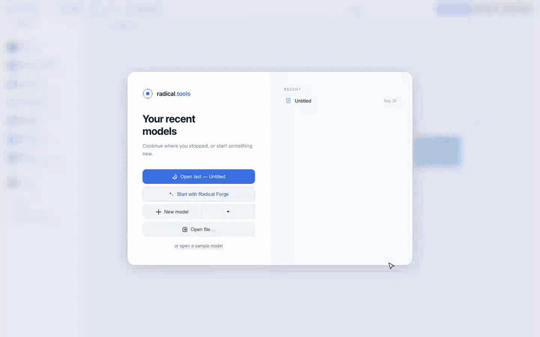
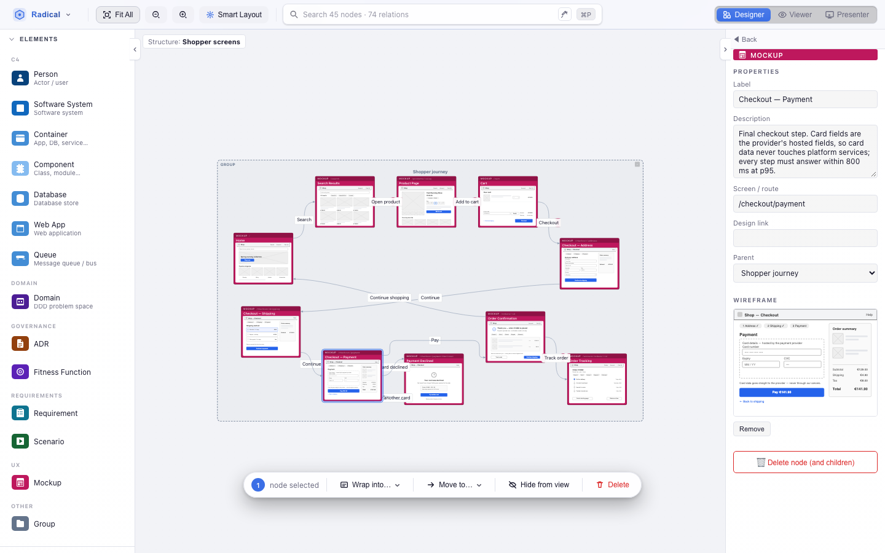
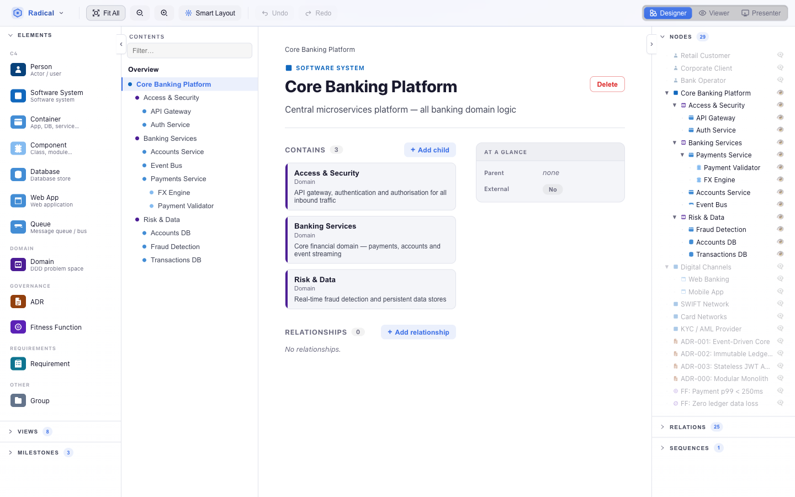

<div align="center">

# radical.tools

**Open-source architecture studio: C4 models, ADRs, fitness functions and requirements in one living model, with an AI co-architect.**

[](https://github.com/radicaltools/radical.tools/actions/workflows/ci.yml)
[](LICENSE)
[](https://studio.radical.tools)

[**Try it in the browser**](https://studio.radical.tools) · [Architecture Hub](https://hub.radical.tools) · [Manual](https://radical.tools/manual.html)



</div>

## Why radical.tools?

Architecture diagrams go stale because they are pictures. In radical.tools they are **views of one model**. Every element lives once, and the canvas, dependency matrix, sequence diagram, table and wiki all read from it. The decisions, requirements and fitness functions that explain the architecture live in the same model, linked to the elements they govern.

- **No account, nothing to install.** Open it in the browser and start modelling. Your model stays in local storage or plain files you can commit.
- **C4 without the busywork.** Smart Layout places nodes, minimises crossings and fits groups for you, and keeps the rows, columns and grids you pin.
- **From a paragraph to a model.** Radical Forge turns a system description into requirements, fitness functions, Gherkin scenarios, state machines, UI mockups and a C4 model, one reviewable stage at a time.
- **Bring your own AI.** OpenAI, Anthropic, Gemini, or a local model through Ollama.
- **Don't start from zero.** Import from 120+ curated patterns, ADRs, fitness functions and blueprints in the [Architecture Hub](https://hub.radical.tools).

<table>
  <tr>
    <td width="50%"><br><sub><b>UI mockups & screen flows</b>, AI-generated wireframes linked to requirements</sub></td>
    <td width="50%"><br><sub><b>Architecture Hub</b>, curated concepts you can import in one click</sub></td>
  </tr>
  <tr>
    <td width="50%"><br><sub><b>Dependency matrix</b>, one of six views over the same model</sub></td>
    <td width="50%"><br><sub><b>Architecture wiki</b>, documentation generated from the model</sub></td>
  </tr>
</table>

## Try it

Open [**studio.radical.tools**](https://studio.radical.tools). No sign-up, nothing to install.

**Desktop app:** there are no prebuilt installers yet. To run it as an Electron app, build it from source (see [Getting started](#getting-started)): `npm install && npm run dist` produces an installer for your OS in `dist/`.

**VS Code:** an extension that opens `.radical` files right in the editor lives in [apps/vscode](apps/vscode).

## Features

- **C4 model**: Person, Software System, Container, Component, Database, Web App, Queue, Relation
- **Domain & Governance elements**: Domain, Entity (aggregate root or entity), ADR, Fitness Function, Need (raw free-text input such as a brief or notes), Requirement (EARS, derived from needs), Blueprint
- **State machines**: event-driven hierarchical statecharts (SCXML semantics) — State Machine, State (compound, parallel regions, final), Pseudostate (initial, history, choice) and Event, linked by transitions that point at their trigger and the events they raise; each machine is the lifecycle of a domain Entity and is implemented by C4 elements; Studio checks that each machine can run (initial states, reachability, unguarded conflicts)
- **UI mockups**: Mockup element with a design link or an AI-generated low-fi wireframe, linked to requirements and scenarios (*illustrates*), to the container that renders it (*presented by*) and to other screens (*navigates to*) to model screen flows
- **Smart Layout**: SA-based auto-layout with crossing minimisation, edge-length optimisation, aspect-ratio penalty, and compound parent fitting
- **Alignments**: keep elements in a row, a column or a grid per view, optionally in the order you selected them (or a container's children with *Align children…*); drags, live physics and Smart Layout hold them, and the AI tools and MCP server can set them
- **Calm drags**: a drag moves only what you drag and pushes clear only what you drop it on; dropped elements stay pinned where you put them (⌘/Ctrl-drag lets the live physics make room instead)
- **Multiple layout engines**: ELK (hierarchical/layered/force), webcola (live physics), custom Smart Layout pipeline
- **AI assistant**: chat with OpenAI / Anthropic / Gemini / Ollama to generate and modify diagrams
- **Radical Forge**: turn a system description into requirements, fitness functions, Gherkin scenarios, state machines, UI mockups and a C4 model, one reviewable stage at a time; the description is kept in the model as a Need the requirements derive from
- **Architecture Hub**: browse and import 120+ curated architecture concepts (patterns, fitness functions, ADRs, requirements, blueprints) from [hub.radical.tools](https://hub.radical.tools); blueprints include per-actor screen flows and named views
- **Multiple views**: Canvas, Matrix, Sequence, Treemap, Table, Wiki per diagram
- **Presentation mode**: fullscreen slides with navigation bar
- **Metamodel editor**: customise node types, relation types, and constraints, with typed properties including references to other elements
- **Time travel**: milestone-based snapshots with named undo/redo
- **Document manager**: multiple diagrams, localStorage + file-system backed
- **Export**: PNG/SVG export, JSON save/load, Electron file dialogs

## Tech stack

| Layer | Technology |
|---|---|
| Shell | Electron 29 |
| Bundler | electron-vite + Vite 5 |
| UI | React 18 + ReactFlow 11 |
| State | Zustand + Immer |
| Layout | ELK.js, webcola, custom SA pipeline |
| Language | TypeScript 5 |

## Getting started

**Prerequisites:** Node.js ≥ 20, npm ≥ 9

```bash
# Install dependencies
npm install

# Start in development mode (Electron, hot-reload)
npm run dev

# Type-check
npm run typecheck

# Run tests
npm test

# Production build (outputs to apps/studio/out/)
npm run build

# Run built Electron app
npm start

# Desktop installers for the current OS (outputs to apps/studio/dist/)
npm run dist

# Build web-only renderer (for deployment to studio.radical.tools)
npm run build:web

# Architecture Hub (hub.radical.tools): dev server / production build
npm run dev:hub
npm run build:hub
```

### Releasing the desktop app (maintainers)

Bump the version and push the tag:

```bash
npm version 1.1.0 -w radical-model   # bumps apps/studio/package.json
git commit -am "release: v1.1.0" && git tag v1.1.0
git push --follow-tags
```

The [Release Desktop App](.github/workflows/release.yml) workflow builds the macOS, Windows and Linux installers and drafts a GitHub Release with them. Review the notes, then publish.

## Project structure

The repo is an npm workspaces monorepo. Run every command from the root; it
forwards to the right workspace.

```
apps/
  studio/         Radical Studio: Electron app + web SPA (studio.radical.tools)
    src/main/       Electron main process (IPC handlers, file dialogs)
    src/preload/    contextBridge API surface exposed to renderer
    src/renderer/src/
      components/   Studio's own UI (Toolbar, Matrix / Sequence / Treemap views,
                    Forge, document manager, modals, …)
      store/        documentStore (localStorage, files, markdown folders)
      persistence/  Autosave: keeps the diagram store and the active document in sync
      ai/           AI chat, providers (OpenAI, Anthropic, Gemini, Ollama), Forge
      platform/     host(): which host Studio runs in (see @radical/host-bridge)
      hub/          Importing Hub concepts into a model
    tests/          Vitest unit/integration tests
    tools/          Sample model generator
    build/          Desktop app icon used by electron-builder
  hub/            Architecture Hub (hub.radical.tools): read-only viewer,
                  built on @radical/ui
  vscode/         VS Code extension; bundles the Studio web build as its webview
  e2e/            End-to-end regression suite (Playwright) for the web builds
                  of Studio and Hub, with screenshot baselines
  mcp/            MCP server for radical models (empty for now)
  web/            Marketing site and manual (radical.tools)
packages/
  common/         @radical/common: C4 + metamodel types, file formats, query
                  language, AI tool catalogue. No UI dependencies
  layout/         @radical/layout: Smart Layout and the headless layout engines,
                  with their tests, benchmark and visual harness
  ui/             @radical/ui: the canvas, panels, Wiki / Table views and the
                  diagram store, shared by Studio and the Hub. Documents and AI
                  plug in from the app (store/documentBackend,
                  components/wireframeGeneration)
  host-bridge/    @radical/host-bridge: typed contract between Studio and its
                  host (Electron, VS Code webview, browser)
  hub-catalogue/  @radical/hub-catalogue: the Hub's concept catalogue (one
                  .radical document per concept), its validation and the Vite
                  plugin that serves and bundles it for the Hub and Studio
infra/            Terraform: AWS S3 + CloudFront + Route53 + IAM (OIDC)
tools/            Repo-wide scripts (generate-icon.js)
docs/             Architecture notes and improvement log
```

## Running tests

```bash
# All tests (vitest)
npm test

# Watch mode
npm run test:watch

# End-to-end regression suite (Playwright) against the web builds
npm run e2e
```

See [apps/e2e/README.md](apps/e2e/README.md) for the e2e suite and its
screenshot baselines.

## Contributing

Contributions are welcome: code, docs, bug reports, and new patterns for the [Architecture Hub](https://hub.radical.tools). Start with [CONTRIBUTING.md](CONTRIBUTING.md) and look for issues labelled [`good first issue`](https://github.com/radicaltools/radical.tools/labels/good%20first%20issue).

If radical.tools is useful to you, a ⭐ on GitHub helps others find it.

## License

[MIT](LICENSE)
